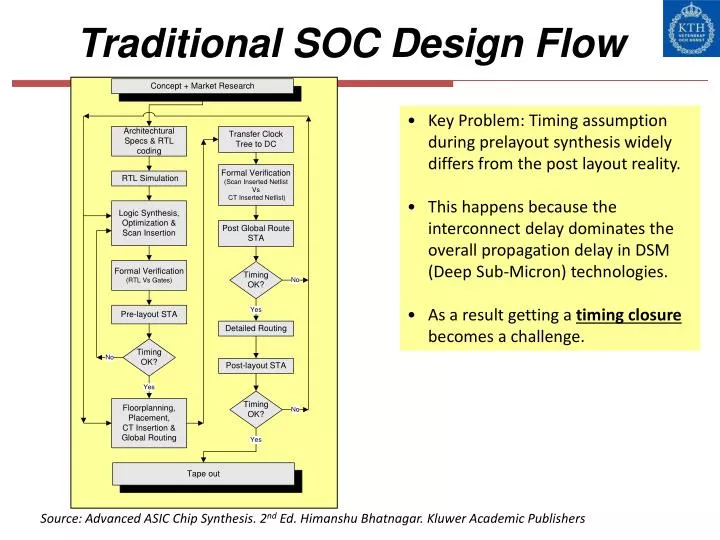
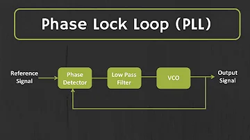
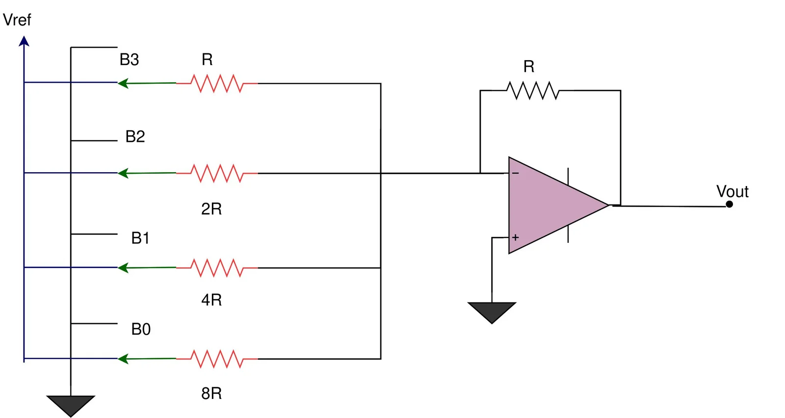

# 📑 Theory Report – BabySoC Fundamentals

---

## 1. Understanding System on a Chip (SoC)

A **System on a Chip (SoC)** is like a **mini-computer built on a single chip**. Instead of needing separate parts for each function, an SoC combines everything into one small package. This makes it especially useful for devices where **space, power, and efficiency** are critical, like smartphones, smartwatches, and tablets.

Let’s break down what an SoC includes and why it’s essential:

---

### 🔹 Key Parts of an SoC

1. **CPU (Central Processing Unit)**

   * The brain of the SoC, handling all main instructions and decisions.
   * Manages tasks like calculations, data processing, and running applications.
   * *Example*: ARM Cortex-A cores inside **Qualcomm Snapdragon** chips that run Android smartphones.

2. **Memory**

   * **RAM (Random Access Memory)** → Temporarily stores data for active applications.
   * **ROM/Flash Storage** → Stores permanent programs like the OS.
   * *Example*: **Samsung Exynos** integrates LPDDR memory for fast app execution.

3. **I/O Ports (Input/Output)**

   * Connect the SoC to peripherals such as cameras, sensors, USB, and displays.
   * *Example*: HDMI interface in **NVIDIA Tegra SoC** powering Nintendo Switch.

4. **Graphics Processing Unit (GPU)**

   * Handles rendering of images, videos, and animations.
   * *Example*: Apple A17 Pro’s GPU supports **hardware-accelerated ray tracing** for console-level gaming.

5. **Digital Signal Processor (DSP)**

   * Optimized for repetitive math operations on audio, video, or sensor data.
   * *Example*: Qualcomm Hexagon DSP improves **noise reduction** in phone calls.

6. **Power Management**

   * Regulates energy use across the SoC to ensure efficiency and battery life.
   * *Example*: Power management units in **wearable SoCs** extend battery life.

7. **Special Features (IP Blocks)**

   * Security modules, Wi-Fi, Bluetooth, and GPS.
   * *Example*: **Google Tensor SoC** integrates an AI-specific TPU block.

---

### 🔹 Why SoCs Are Important

* **Space Saving**: Combines multiple chips into one compact solution.
* **Energy Efficient**: Consumes less power → crucial for mobiles and IoT.
* **High Performance**: Faster communication between modules.
* **Cost Effective**: Cheaper than multiple discrete chips.
* **Reliability**: Fewer interconnections → fewer failures.

---

### 🔹 Applications of SoCs

* **Smartphones & Tablets**: Apple A-series, Qualcomm Snapdragon.
* **Wearables**: Galaxy Watch with Exynos W-series.
* **IoT Devices**: ESP32 SoCs in smart sensors.
* **Automotive**: NVIDIA DRIVE for autonomous driving.
* **Consumer Electronics**: MediaTek SoCs in Smart TVs.

---

### 🔹 Some Popular SoCs

* **Apple A-series** → Powers iPhones/iPads.
* **Qualcomm Snapdragon** → Used in Android flagships.
* **Samsung Exynos** → Designed for Samsung devices.
* **NVIDIA Tegra** → Found in Nintendo Switch.

---

### 🔹 Challenges in SoC Design

* **Complexity** → Needs advanced EDA workflows.
* **Heat Issues** → Dense transistor packing leads to thermal concerns.
* **Less Flexibility** → Hard to modify after fabrication.

---

## 2. Types of SoCs

1. **Microcontroller-based SoC**

   * Designed for simple control tasks with low power.
   * *Example*: **NXP Kinetis K-series** in cars, appliances, IoT devices.

2. **Microprocessor-based SoC**

   * Powerful SoCs that run operating systems.
   * *Example*: **Snapdragon 8 Gen 3** in Android phones.

3. **Application-Specific SoC (ASIC-based SoC)**

   * Optimized for a dedicated purpose like AI or graphics.
   * *Example*: **Google TPU** → AI acceleration in Google Cloud.

---

## 3. SoC Design Flow

The design process of SoCs mirrors a **product lifecycle**, from concept to final chip:

1. System Specification
2. IP Integration
3. RTL Design & Verification
4. Synthesis & Floorplanning
5. Physical Design & DRC/LVS
6. Tapeout & Fabrication
7. Testing & Validation

---

## 4. VSD BabySoC Project

**Problem Statement**:
This project focuses on building a **compact, open-source SoC** based on **RVMYTH (RISC-V)**. The BabySoC integrates:

* A **Phase-Locked Loop (PLL)** for stable clock generation.
* A **10-bit Digital-to-Analog Converter (DAC)** for analog interfacing.

By converting digital signals into analog, BabySoC enables output to **TVs, phones, or speakers**, showcasing real-world multimedia interfacing.
Built on **Sky130 technology**, it serves as an **educational platform** for open-source VLSI learning.

---

## 5. Introduction to VSDBabySoC

### Components of BabySoC

* **RVMYTH CPU (RISC-V)**: Executes instructions, manages registers, drives data.
* **PLL (Phase-Locked Loop)**: Generates synchronized clocks for reliable operation.
* **DAC (10-bit)**: Converts digital data into analog voltage outputs.

**Workflow Example**:

1. RVMYTH updates register `r17` with values.
2. PLL synchronizes CPU and DAC clocks.
3. DAC converts `r17` values into analog signals.
4. Analog output drives **TVs, speakers, or mobile displays**.

---

## 6. Phase-Locked Loop (PLL)

A **PLL** aligns the frequency & phase of an output signal with a reference input.

**Core Components**:

* **Phase Detector** → Compares reference vs oscillator.
* **Loop Filter** → Smooths out noise.
* **VCO** → Adjusts frequency dynamically.

**Industry Example**: PLLs in **Intel CPUs** scale frequencies dynamically for turbo boost.

---

### 🔹 Why Off-Chip Clocks Can’t Always Be Used

* **Clock Distribution Delays** → Skew from long wires.
* **Clock Jitter** → Noise affects synchronization.
* **Different Frequency Needs** → Blocks may require varied speeds.
* **Crystal Deviations** → Frequency tolerance, stability, and aging issues.

---

## 7. Digital-to-Analog Converter (DAC)

A **DAC** transforms binary inputs into analog voltages/currents.

**Types of DACs**:

1. **Weighted Resistor DAC**
   

   * Uses resistors in powers of 2.
   * Accurate but requires precise resistor ratios.

2. **R-2R Ladder DAC**
   

   * Uses only two resistor values → scalable in VLSI.
   * Widely used in SoCs due to ease of fabrication.

**In BabySoC**:

* 10-bit DAC converts CPU outputs (0–1023 range) into analog voltages.
* *Example*: CPU outputs 512 → DAC outputs ~50% of max analog voltage.

---

## 8. BabySoC Workflow (Lab Session Preview)

**Steps**:

1. Initialize RVMYTH CPU.
2. PLL generates synchronized system clock.
3. RVMYTH updates register values.
4. DAC converts digital outputs → analog signals.
5. Analog signals transmitted to display/speaker devices.

---

## 9. Understanding SoC Design Fundamentals & BabySoC’s Role

Designing a System on a Chip (SoC) is like building a **tiny city on a single piece of silicon** — where each block (CPU, memory, I/O, GPU, DSP, etc.) works together seamlessly. SoC design fundamentals involve understanding how to integrate diverse components efficiently while balancing **performance, power, and area constraints**. This requires skills in **hardware architecture, circuit design, physical layout, and verification**, along with careful planning of interfaces between modules. The goal is to create a compact yet powerful chip that can handle complex tasks without consuming excessive power — much like fitting an entire computer, entertainment system, and power grid into a microchip.

BabySoC serves as a **hands-on introduction to the world of SoC design**, bridging theory with practice. By integrating a RISC-V CPU, a Phase-Locked Loop (PLL), and a 10-bit DAC on a single chip, it gives students a real-life example of an SoC. BabySoC not only demonstrates digital logic and processor design but also shows how digital systems connect with the analog world. Imagine a student building a tiny music player on a chip — where their code running on the RVMYTH CPU directly controls sound output to a speaker through the DAC — that’s the power of BabySoC in action.

---

### 🎯 Fun & Engaging SoC Examples for Students

* **Gaming Consoles** → The Nintendo Switch uses an NVIDIA Tegra SoC to combine CPU, GPU, and I/O so you can play high-definition games in a compact handheld console.
* **Smart Watches** → Apple Watch uses tiny SoCs to manage fitness tracking, heart monitoring, and display updates without draining the battery.
* **Self-Driving Cars** → Tesla’s SoCs handle AI perception, path planning, and control in real time — the CPU is literally driving the car.
* **Smart Speakers** → Amazon Echo uses SoCs to process voice commands, connect to the cloud, and deliver audio without a bulky computer.
* **DIY Projects** → With open-source SoCs like BabySoC, students can build custom projects such as an AI-powered alarm clock, or a portable game console, right from their own code.

